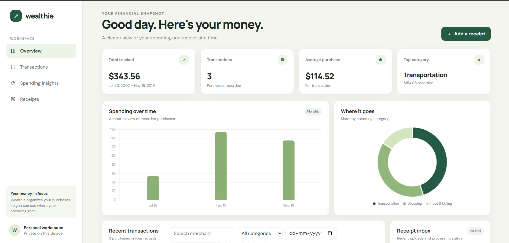

# Wealthie

### A clearer view of your spending, one receipt at a time.

Wealthie is a personal finance dashboard that turns receipt photos into an organized, searchable view of everyday spending. Upload a receipt, review the extracted purchase, follow spending trends, and export your records from a local personal workspace.

[](https://www.python.org/)
[](https://fastapi.tiangolo.com/)
[](https://www.gnu.org/licenses/gpl-3.0.html)

## Product snapshot



The dashboard brings spending totals, monthly activity, category breakdowns, recent transactions, and receipt processing status into one responsive workspace.

## Highlights

- **Receipt capture:** Upload JPG, PNG, and WebP files with drag and drop or the file picker.
- **AI-assisted extraction:** When configured, Google Gemini reads merchant, date, total, category, tax, payment method, line items, and confidence data.
- **Review and organize:** Track processing status, edit transaction details, and search or filter purchases by merchant, category, and date.
- **Understand spending:** View monthly trends, category totals, and average purchase metrics.
- **Take your data with you:** Export transaction records as CSV or JSON.
- **Local-first storage:** Keep transaction and receipt records in SQLite with uploaded images stored on the configured local disk.

## Built with

| Area | Technology |
|---|---|
| Application API | Python, FastAPI, Pydantic |
| Persistence | SQLAlchemy async, SQLite, aiosqlite |
| Receipt extraction | Google Gemini API |
| Image processing | Pillow |
| Dashboard | HTML, CSS, JavaScript, Chart.js |

## Getting started

### Prerequisites

- Python 3.10 or newer
- A Google Gemini API key for receipt extraction

### Install and run

```bash
git clone https://github.com/Subhashis-1/wealthie.git
cd wealthie
python -m venv .venv
```

Activate the environment:

```powershell
# Windows PowerShell
.venv\Scripts\Activate.ps1
```

```bash
# macOS or Linux
source .venv/bin/activate
```

Install dependencies and create your local configuration:

```bash
pip install -r requirements.txt
```

```powershell
# Windows PowerShell
Copy-Item .env.example .env
```

```bash
# macOS or Linux
cp .env.example .env
```

Add your Gemini key and a private API key to `.env`, then start the server:

```bash
uvicorn main:app --reload
```

Open [http://localhost:8000](http://localhost:8000) for the dashboard or [http://localhost:8000/docs](http://localhost:8000/docs) for the interactive API documentation.

## Configuration

| Variable | Purpose | Default |
|---|---|---|
| `GEMINI_API_KEY` | Enables receipt extraction through Gemini | — |
| `API_KEY` | Protects transaction update and delete endpoints | — |
| `DATABASE_URL` | SQLAlchemy database connection | `sqlite+aiosqlite:///./wealthie.db` |
| `UPLOAD_DIR` | Directory for uploaded receipt images | `./uploads` |
| `MAX_IMAGE_SIZE_MB` | Maximum accepted upload size | `10` |
| `MAX_CONCURRENT_JOBS` | Maximum in-process receipt jobs | `5` |
| `ALLOWED_ORIGINS` | Comma-separated browser origins accepted by CORS | `http://localhost:8000` |
| `LOG_LEVEL` | Application logging level | `INFO` |

The database and uploaded receipts are local runtime data and are excluded from Git. Keep `.env` private and do not commit credentials.

## How it works

```text
Receipt image → FastAPI upload → SQLite receipt record → background processing
                                                        ↓
Dashboard ← Reports and exports ← Transaction API ← Gemini extraction
```

The application validates and prepares receipt images, sends them to Gemini when configured, validates the extracted transaction, and makes the result available through the API and dashboard. Receipt processing uses in-process background tasks with a concurrency limit; it is intended for a single-user local setup rather than a durable multi-instance production queue.

## API at a glance

| Method | Endpoint | Description |
|---|---|---|
| `GET` | `/health` | Health status |
| `POST` | `/api/receipts/upload` | Upload and process a receipt |
| `GET` | `/api/receipts/` | List recent receipts |
| `GET` | `/api/receipts/{id}/status` | Check receipt processing status |
| `GET` | `/api/transactions/` | List and filter transactions |
| `GET` | `/api/transactions/{id}` | Read a transaction |
| `PUT` | `/api/transactions/{id}` | Update transaction details |
| `DELETE` | `/api/transactions/{id}` | Soft-delete a transaction |
| `GET` | `/api/reports/summary` | Read spending summaries |
| `GET` | `/api/reports/export/csv` | Export transactions as CSV |
| `GET` | `/api/reports/export/json` | Export transactions as JSON |

Transaction updates and deletion require the `X-API-Key` request header. Wealthie prompts for the key and keeps it in the current browser tab's session storage.

## Project structure

```text
wealthie/
├── background/     Receipt processing jobs
├── routers/        Receipt, transaction, and reporting endpoints
├── services/       Gemini extraction and image preparation
├── static/         Dashboard interface
├── docs/assets/    README product snapshots
├── config.py       Environment-backed settings
├── database.py     Async SQLAlchemy engine and sessions
├── models.py       Receipt and transaction models
├── schemas.py      API request and response schemas
└── main.py         FastAPI application setup
```

## Privacy and responsible use

Receipt images can contain personal and payment information. Store them carefully, and review Google's Gemini terms before sending receipt data to its service. The current application does not provide user accounts or per-user data isolation; do not expose a development instance as a public multi-user service. Wealthie helps organize personal records and is not financial, tax, or accounting advice.

## Attribution and license
Wealthie is distributed under the [GNU General Public License v3.0](https://www.gnu.org/licenses/gpl-3.0.html). 
---

<p align="center">Built to make everyday spending easier to understand.</p>
